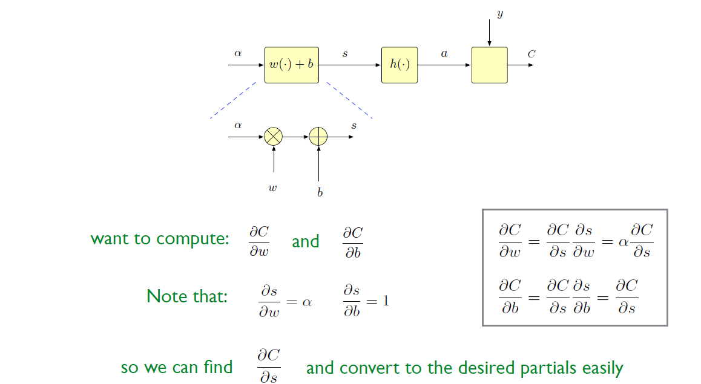
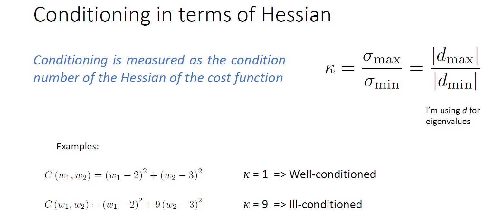
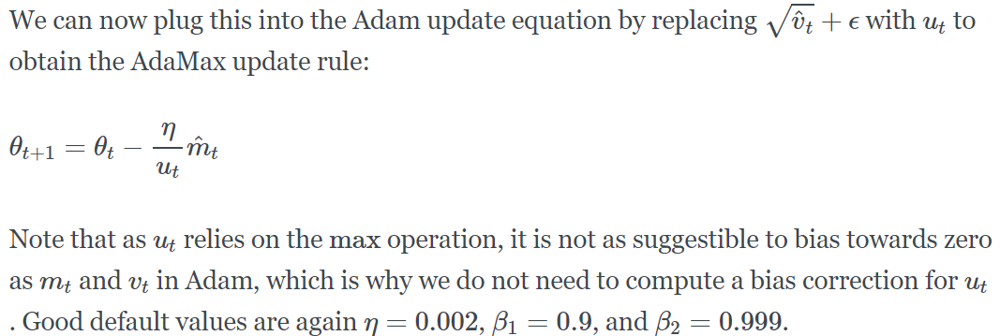
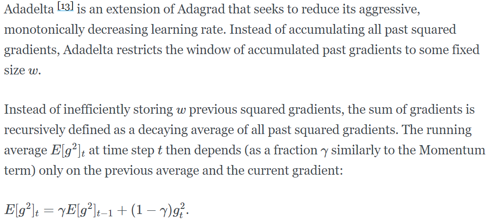
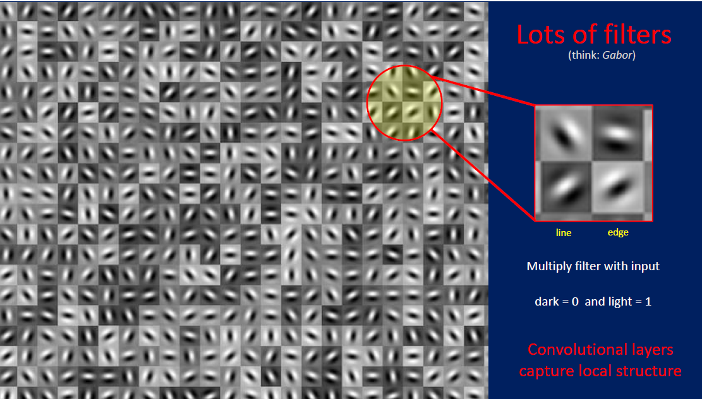
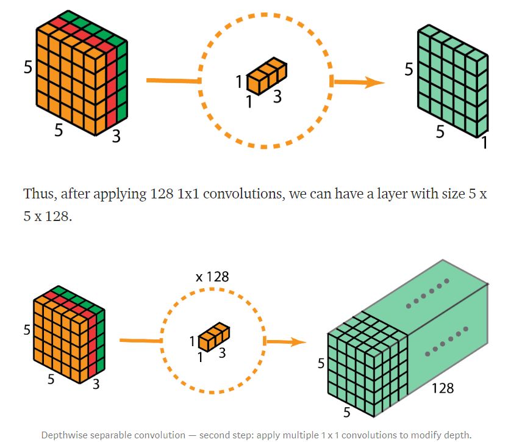
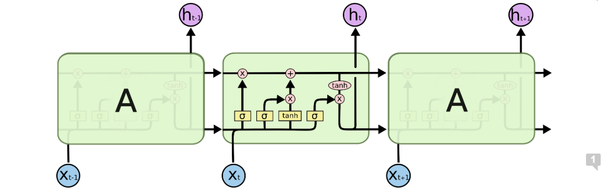
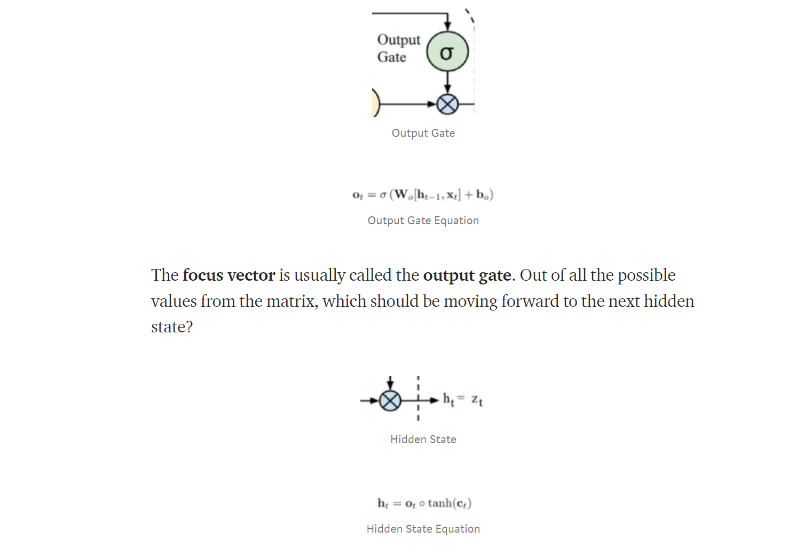

# **Deep Learning**

This note is based on course I took from USC in 2019 spring,  [EE599 Deep Learning](https://web-app.usc.edu/soc/syllabus/20191/31097.pdf) taught by Prof. Keith Michael Chugg and [Brandon Franzke](https://viterbi.usc.edu/directory/faculty/Franzke/Brandon-Sterling).\
Thanks!

1. [Basic concept Introduction](#basic-concept-introduction)

   1. [Gradient Descent](#gradient-descent)

   2. [when to use deep learning](#when-to-use-deep-learning)

   3. [MMSE](#mmse)

   4. [Decision Theory](#decision-theory)

   5. [MAP](#map)

   6. [ML](#ml)

   7. [Entropy](#entropy)

   8. [Regulatization](#regulatization)

   9. [Train/Test Split](#train/test-split)

2. [Simple DNN](#simple-dnn)

   1. [Forward Propagation](#forward-propagation)

   2. [Back Propagation](#back-propagation)

      1. [idea](#idea)

      2. [summary](#summary)

      3. [regularizer](#regularizer)

3. [Multi-Layer Perceptron](#multi-layer-perceptron)

   1. [A Big Picture](#a-big-picture)

   2. [Activation Function](#activation-function)

   3. [Cost Function](#cost-function)

   4. [Optimizer](#optimizer)

   5. [Momentum](#momentum)

   6. [Differenct Kinds of Optimizers](#different-kinds-of-optimizers)
   
      1. [RMSprop](#rmsprop)

      2. [Adam](#adam)

      3. [SGD](#sgd)

      4. [AdaMax](#adamax)

      5. [Adadelta](#adadelta-(fastest))

      6. [which optimizer is best?]()

   7. [Regularization](#regularization)

   8. [Dropout](#dropout)

   9. [Normalization](#normalization)

   10. [Dimensionality Reduction](#dimensionality-reduction)

       1. [PCA](#pca)

       2. [LDA](#lda)

   11. [Hyper parameter](#hyper-parameter)

   12. [Universal Approximation Theorem](#universal-approximation-theorem)

4. [CNN](#cnn)

   1. [CNN Introduction](#cnn-introduction)

   2. [Kernel(Filter)](#kernel(filter))

   3. [Conv layer](#conv-layer)

   4. [Pooling layer](#pooling-layer)

   5. [De-Conv(Transpose convolution) layer](#de-conv(transpose-convolution)-layer)

   6. [Group Convolution](#group-convolution)

   7. [Seperable Convolutions](#seperable-convolutions)

        1. [Depthwise Separable Convolutions](#Depthwise-Separable-Convolutions)

        2. [drawback](#drawback)


   8. [Different Nets](#different-nets)

      1. [LeNet(1998)](#lenet(1998))

      2. [AlexNet(2012)](#alexnet(2012))

      3. [VGG](#vgg)

      4. [Resnet](#resnet)

      5. [GoogleNet (Inception)](#googlenet(inception))

      6. [MobileNet](#mobilenet)

      7. [Comparation](#comparation)

   9. [CNN in NLP](#cnn-in-nlp)

   10. [Coding](#coding)

       1. [Keras](#4059-1567559736866)

5. [RNN](#rnn)

   1. [RNN Introduction](#rnn-introduction)

   2. [Vanish Gradient Problem](#vanish-gradient-problem)

   3. [LSTM](#lstm)

        1. [Core Concept](#core-concept)

        2. [Forget Gate](#forget-gate)

        3. [Input Gate](#input-gate)

        4. [Cell Gate](cell-gate)

        5. [Output Gate](#output-gate)

        6. [OTHER VERSION(Keras)](#other-version(keras))

        7. [other version of LSTM intorduction](#other-version-of-lstm-introduction)

   4. [GRU](#gru)

      1. [Update gate](#update-gate)

      2. [Reset Gate](#reset-gate)

   5. [Back-Propagation through Time (BPTT)](#Back-Propagation-through-Time-(BPTT))

   6. [Word Embedding](#word-embedding)

   7. [RNN Model](#rnn-model)

      1. [BERT](#bert)

   8. [TensorFlow and Keras](#tensorflow-and-keras)

      1. [sequential model](#5571-1566968973805)

7. [Pytorch](#pytorch)


## **Basic Concept Introduction**   
[Back](#deep-learning)

### **Gradient Descent**

Steepest Gradient Descent


Stochastic Gradient Descent


single point stochastic gradient descent


### **when to use deep learning**

Don't


Do


### **MMSE**


### **Decision Theory**


### **MAP**


### **ML**


### **Entropy**


### **cross entropy**


### **binary cross entropy**   [back content](#Introduction)


### **Regulatization**

enforce penalty on weights to bias toward a prior distribution. --\&gt; to reduce over-fitting (by smaller weight)


### **Train/Test Split**

Training Set -- for define trainable parameters

Validation Set -- for define hyper-parameters

Test Set -- for verify model performance

Mini- Batch -- for do one SGD update per mini-batch

epoch -- one training run through all data set

iteration -- number of mini-batches per epoch

## **Simple DNN**
[Back](#deep-learning)

1. Input an example from a dataset.
2. The network will take that example and apply some complex computations to it using randomly initialised variables (called weights and biases).
3. A predicted result will be produced.
4. Comparing that result to the expected value will give us an error.
5. Propagating the error back through the same path will adjust the variables.
6. Steps 1–5 are repeated until we are confident to say that our variables are well-defined.
7. A predication is made by applying these variables to a new unseen input.


### **Forward Propagation**

### **Back Propagation**

#### **idea**


To be specified, one step of forward neural net can be extracted as follow:




work for matrix (vector case)


#### **summary**


#### **using batch**

so it&#39;s like compute several data points with same **w** and **δ** and use average as the update delta


#### **regularizer**


## **Multi-Layer Perceptron**
[Back](#deep-learning)

### **A Big Picture**


### **Activation Function**

### **middle layers Activation Function**

sigmoid &amp; tanh


problem: vanish


more important: **ReLU family -- will not vanish**


### **Output Activation Function**


### **Cost Function**

Cross-entropy Cost

One Hot label vs. Softmax

Quadratic Cost (MSE)


### **Optimizer**

[Back](#deep-learning)

**Hessian**


**Condition**



will condition lead to fast gradient

### **Momentum**


α (Momentum factor) normally i **ncrease** with the step goes

η (Learning Rate) **decrease** with step goes


Nesterov Momentum


### **Different Kinds of Optimizers**

[Back](#deep-learning)


#### **RMSprop**


#### **Adam (more complex compared to RMSprop)**


#### **SGD**

(may include momentum and learning rate)

more basic, need more experience

#### **AdaMax**





#### **Adadelta (fastest)**



#### **which optimizer is best?**

**RMSprop** is an extension of Adagrad that deals with its radically diminishing learning rates. It is **identical to Adadelta** , except that Adadelta uses the RMS of parameter updates in the numinator update rule. Adam, finally, adds bias-correction and momentum to RMSprop. Insofar, **RMSprop, Adadelta** , and **Adam** are very similar algorithms that do well in similar circumstances.

### **Regularization**

bias- variance trade-off (in EE660) ( **for a given MSE** )

### **Dropout**


Esemble method turn to drop out


### **Normalization**


### **Dimensionality Reduction**

SVD: singular value decomposition

#### **PCA**


#### **LDA**

need labels of all data, change data based on it&#39;s label


### **Hyper parameter**

things Neural Network don't learning by themself


### **use cross validation to set hyper-parameters**
[Back](#deep-learning)

**Hyper-parameter seatch**


**Learning Rate Schedules**


### **Universal Approximation Theorem**
[Back](#deep-learning)

basic idea: Neural Network can simulate all function

[a visual proof that neural nets can compute any function](http://neuralnetworksanddeeplearning.com/chap4.html)


## **CNN**
[Back](#deep-learning)


### **CNN Introduction**

good introduction by [Stanford online class](http://cs231n.github.io/convolutional-networks/#pool)

In summary:

1. A ConvNet architecture is in the simplest case a list of Layers that transform the image volume into an output volume (e.g. holding the class scores)
2. There are a few distinct types of Layers (e.g. CONV/FC/RELU/POOL are by far the most popular)
3. Each Layer accepts an input 3D volume and transforms it to an output 3D volume through a differentiable function
4. Each Layer may or may not have parameters (e.g. CONV/FC do, RELU/POOL don't)
5. Each Layer may or may not have additional hyperparameters (e.g. CONV/FC/POOL do, RELU doesn't)

### **Kernel(Filter)**

Slide

Padding

size:

small (3\*3) deep

large (5\*5) fast reduction,shallow, more parameters



### **Conv layer**

image: 3-D in volume

**basic:** each neural is only connect to some of the neural in next layer

#### **Basic Function of Conv-layer:**

also like Σ(wx)+b (if **b** exist?)


use dot production to compute kernel\* cut part

Intuitively, the network will learn filters that activate when they see some type of visual feature such as an edge of some orientation or a blotch of some color on the first layer, or eventually entire honeycomb or wheel-like patterns on higher layers of the network.

### **Hyper-Parameters**

[Back](#deep-learning)

* **depth**

number of filters we want to use, they will look into the same region

* **stride**

commonly --> 1

* **zero-padding**

we could:

1. control the output volume size

2. remain the edge information

* **For three channel**

three filters to combine a kernel, three output add up together, and add bias


* **dilation**

it&#39;s possible to have filters that have spaces between each cell, called dilation.

in one dimension a filter w of size 3 would compute over input x the following: `w[0]\*x[0] + w[1]\*x[1] + w[2]\*x[2]`. This is dilation of 0. For dilation 1 the filter would instead compute `w[0]\*x[0] + w[1]\*x[2] + w[2]\*x[4]`

so the computed block is not continous

#### **compute output size(O)**

by input size( **W** ), filter size( **F** ) and stride( **S** ) and amount of zero padding( **P** )

O=(W−F+2P)/S+1.

input W\*W output O\*O

#### **Parameter Sharing(weight sharing)**

one feature is useful to compute at some spatial position (x,y), then it should also be useful to compute at a different position (x2,y2). In other words, denoting a single 2-dimensional slice of depth as a  **depth slice**

we are going to constrain the neurons in each depth slice to use the same weights and bias

for example: for a 11\*11 kernel in RGB with 96 filters

there are 96\*11\*11\*3+96 = 34944 parameters in totally

 all 55\*55 neurons in each depth slice will now be using the same parameters.

questions? each filter has three channel or just one?


**a new method: seperable convolution**

**Xception**

convert 3\*3 kernel to 3\*1 and 1\*3 (used in Enmedded system)

#### **Pooling layer**

  Its function is to progressively reduce the spatial size of the representation to **reduce the amount of parameters and computation in the network** , and hence to also control overfitting.

Max pooling | average pooling | L2-norm pooling

**Extents-->** # of points pooling together

**Stride -->** # of step to move in next pooling


#### **De-Conv(Transpose convolution) layer**

convolution: a pixels block into a point --> down sampling

de-convolution: a point to a block --\&gt; up sampling, from a low resolution to a higher one

use one point in the previous layer to generate 3\*3 blocks with the help of filter

For an example in the image below, we apply transposed convolution with a 3 x 3 kernel over a 2 x 2 input padded with a 2 x 2 border of zeros using unit strides. The up-sampled output is with size 4 x 4.


map e.g. 4-dimensional space to 25-dimensional space


Transposed 2D convolution with no padding, stride of 2 and kernel of 3

### **Group Convolution**

In each filter group, the depth of each filter is only half of the that in the nominal 2D convolutions. They are of depth Din / 2. Each filter group contains Dout /2 filters. The first filter group (red) convolves with the first half of the input layer ([:, :, 0:Din/2]), while the second filter group (blue) convolves with the second half of the input layer ([:, :, Din/2:Din]). As a result, each filter group creates Dout/2 channels. Overall, two groups create 2 x Dout/2 = Dout channels. We then stack these channels in the output layer with Dout channels.

#### **Advantage:**

efficient training.

model is more efficient

Grouped convolution may provide a better model than a nominal 2D convolution.


**this is a bit similar like seperable convolutions**

If the number of filter groups is the same as the input layer channel, each filter is of depth Din / Din = 1. This is the same filter depth as in depthwise convolution.

### **Seperable Convolutions**

Efficiency!

in [**MobileNet:**](https://arxiv.org/pdf/1704.04861.pdf)

change the 3\*3 kernel to 3\*1 and 1\*3 two kernel This would require 6 instead of 9 parameters while doing the same operations.


Although spatially separable convolutions save cost, it is rarely used in deep learning. One of the main reason is that not all kernels can be divided into two, smaller kernels. If we replace all traditional convolutions by the spatially separable convolution, we limit ourselves for searching all possible kernels during training. The training results may be sub-optimal.

#### **Depthwise Separable Convolutions**

much commonly used in deep learning: **depthwise convolution** and **1\*1 convolution**

First, we apply **depthwise convolution** to the input layer. Instead of using a single filter of size 3 x 3 x 3 in 2D convolution, we used **3 kernels** , **separately.** Each filter has size **3 x 3 x 1**. Each kernel convolves with 1 channel of the input layer (1 channel only, not all channels!). We then stack these maps together to create a 5 x 5 x 3 image. After this, we have the output with size 5 x 5 x 3.

As the second step of depthwise separable convolution, to extend the depth, we apply the 1x1 convolution with kernel size 1x1x3. Convolving the 5 x 5 x 3 input image with each 1 x 1 x 3 kernel provides a map of size 5 x 5 x 1.

Thus, after applying 128 1x1 convolutions, we can have a layer with size 5 x 5 x 128.




#### **drawback:**

reduces the number of parameters in the convolution. As such, for a small model, the model capacity may be decreased significantly if the 2D convolutions are replaced by depthwise separable convolutions.

**Full Connect layer**

**# of Parameters computation**

**Visualization**

 layers that are deeper in the network visualize more training data specific features, while the earlier layers tend to visualize general patterns like edges, texture, background

**Visualize different layer**

**Visualize filter**

**Heatmap**

### **Different Nets**

[Back](#deep-learning)

#### **LeNet(1998)**

classifies digits in 32x32 pixel greyscale inputimages


#### **AlexNet(2012)**

  deeper, with more filters per layer, and with stacked convolutional layers. It consisted 11x11, 5x5,3x3, convolutions, max pooling, dropout, data augmentation, ReLU activations, SGD with momentum.

train on two GPUs


#### **VGG**

[VGG paper here](https://arxiv.org/pdf/1409.1556.pdf)

Baseline feature extractor

16 (weighted) layers CNN 138M parameters


#### **Resnet**

gated recurrent units

take a standard feed-forward ConvNet and add **skip connections** that bypass (or shortcut) a few convolution layers at a time. Each bypass gives rise to a residual block in which the convolution layers predict a residual that is added to the block&#39;s input tensor.

aim to avoid vanish gradient


#### **GoogleNet (Inception)**


[Inception paper 1](https://arxiv.org/pdf/1409.4842.pdf)

[Inception paper 2](https://arxiv.org/pdf/1512.00567.pdf)

no Pooling layer

##### **Inception Introduction**

The network used a CNN inspired by LeNet but implemented a novel element which is dubbed an inception module. It used batch normalization, image distortions and RMSprop. This module is based on several very small convolutions in order to drastically reduce the number of parameters. Their architecture consisted of a 22 layer deep CNN but reduced the number of parameters from 60 million (AlexNet) to 4 million.

##### **Speciality**

1. use several small filter to stand large filter --\&gt; n\*1 + 1\*n to replace n\*n

2. for a single input layer, applied many different filters(some are pooling, some are 1\*1 with 1\*n with n\*1) and concatedate result (add together)

---> **to avoid representational bottlenecks and avoid stop locally**


#### **MobileNet**

[MobileNwet Paper](https://arxiv.org/pdf/1704.04861.pdf)

Deepwise Seperable Convolution + Pointwise Convolution (1\*1)


MobileNet的网络结构如表1所示。首先是一个3x3的标准卷积，然后后面就是堆积depthwise separable convolution，并且可以看到其中的部分depthwise convolution会通过strides=2进行down sampling。然后采用average pooling将feature变成1x1，根据预测类别大小加上全连接层，最后是一个softmax层。如果单独计算depthwise

convolution和pointwise convolution，整个网络有28层（这里Avg Pool和Softmax不计算在内）。我们还可以分析整个网络的参数和计算量分布，如表2所示。可以看到整个计算量基本集中在1x1卷积上，如果你熟悉卷积底层实现的话，你应该知道卷积一般通过一种im2col方式实现，其需要内存重组，但是当卷积核为1x1时，其实就不需要这种操作了，底层可以有更快的实现。对于参数也主要集中在1x1卷积，除此之外还有就是全连接层占了一部分参数。


#### **Comparation**


### **CNN in NLP**


### **CNN Keras Coding**

a basic model

``` py
from keras.models import Sequential 
from keras.layers import Dense, Conv2D, Flatten

#create model 
model = Sequential()

#add model layers 
model.add(Conv2D(64, kernel_size=3, activation='relu', input_shape=(28,28,1))) 
model.add(Conv2D(32, kernel_size=3, activation='relu')) 
model.add(Flatten()) 
model.add(Dense(10, activation='softmax'))

# Compiling the model takes three parameters: optimizer, loss and metrics. 
model.compile(optimizer='adam', loss='categorical_crossentropy&', metrics=['accuracy']) 

#train the model 
model.fit(X_train, y_train, validation_data=(X_test, y_test), epochs=3) 
#predict first 4 images in the test set 
model.predict(X_test[:4]) 

## another example of CNN
model = Sequential() 
model.add(Conv2D(32, (3, 3), padding='same',input_shape=x_train.shape[1:])) 
model.add(Activation('relu')) 
model.add(Conv2D(32, (3, 3))) 
model.add(Activation('relu')) 
model.add(MaxPooling2D(pool_size=(2, 2))) 
model.add(Dropout(0.25)) 
model.add(Conv2D(64, (3, 3), padding='same'))
model.add(Activation('relu')) 
model.add(Conv2D(64, (3, 3))) 
model.add(Activation('relu')) 
model.add(MaxPooling2D(pool_size=(2, 2))) 
model.add(Dropout(0.25)) 
model.add(Flatten()) 
model.add(Dense(512)) 
model.add(Activation('relu')) 
model.add(Dropout(0.5)) 
model.add(Dense(num_classes)) 
model.add(Activation('softmax'))
```

 **Flatten layer**: Flatten serves as a connection between the convolution and dense layers.

## **RNN**
[Back](#deep-learning)

### **RNN Introduction**

_x\_1, x\_2, x\_3, …, x\_t_ represent the input words from the text, _y\_1, y\_2, y\_3, …, y\_t_ represent the predicted next words and _h\_0, h\_1, h\_2, h\_3, …, h\_t_ hold the information for the previous input words.


basic structure


### **STATE**

state machine: network is stated:


(Vanilla RNN)

Keras code

```py
keras.layers.SimpleRNN(units, activation='tanh', use_bias=True, kernel_initializer='glorot_uniform', recurrent_initializer='orthogonal', bias_initializer='zeros', kernel_regularizer=None, recurrent_regularizer=None, bias_regularizer=None, activity_regularizer=None, kernel_constraint=None, recurrent_constraint=None, bias_constraint=None, dropout=0.0, recurrent_dropout=0.0, return_sequences=False, return_state=False, go_backwards=False, stateful=False, unroll=False)
```

### **Diagram of Neural Net**


#### **Number of nodes and parameters in each layer (blue block on upper diagram)**


Node on layer: n

Node on previous layer: m

input: m

output: n

**parameters** : **(m+n)\*n** (weight) **+n** (bias)

When training, a training window length T is selected =\&gt;

a sequence of input of length T

a sequence of label of length T

[a good blog of RNN introduction](http://www.wildml.com/2015/09/recurrent-neural-networks-tutorial-part-1-introduction-to-rnns/)

### **Vanish Gradient Problem**


### **GATE**

To solve this problem we need to add GATE which is attenuating and/or filtering in the state update equation (my understanding: amplify the influence of previous state)


All gate are trainable parameters and are learned using a single layer feedforward network (my understanding: GATE make simple m\*n parameters network more complex, though if we block the process, it is still a m input and n output problem, the inner parametes(weight) are no longer n(m+n+1), it because more complex, but still based on **V(n\*n), W(m\*n), b (n)**


tanh make the output in between -1 --> 1

### **LSTM**




These operations are used to allow the LSTM to keep or forget information.

#### **Core Concept**

The core concept of LSTM's are the cell state, and it's various gates. The cell state act as a transport highway that transfers relative information all the way down the sequence chain. You can think of it as the &quot;memory&quot; of the network. The cell state, in theory, can carry relevant information throughout the processing of the sequence. So even information from the earlier time steps can make it&#39;s way to later time steps, reducing the effects of short-term memory. As the cell state goes on its journey, information get&#39;s added or removed to the cell state via gates. The gates are different neural networks that decide which information is allowed on the cell state. The gates can learn what information is relevant to keep or forget during training.

there are two state value(cell and hiden in each state)

#### **Forget Gate**

This gate decides what information should be thrown away or kept. Information from the previous hidden state and information from the current input is passed through the sigmoid function. Values come out between 0 and 1. The closer to 0 means to forget, and the closer to 1 means to keep.


#### **Input Gate**

First, we pass the previous hidden state and current input into a sigmoid function. That decides which values will be updated by transforming the values to be between 0 and 1. 0 means not important, and 1 means important. You also pass the hidden state and current input into the tanh function to squish values between -1 and 1 to help regulate the network. Then you multiply the tanh output with the sigmoid output. The sigmoid output will decide which information is important to keep from the tanh output.


#### **Cell Gate**

First, the cell state gets pointwise multiplied by the forget vector. This has a possibility of dropping values in the cell state if it gets multiplied by values near 0. Then we take the output from the input gate and do a pointwise addition which updates the cell state to new values that the neural network finds relevant. That gives us our new cell state.


#### **Output Gate**

The output gate decides what the next hidden state should be. Remember that the hidden state contains information on previous inputs. The hidden state is also used for predictions. First, we pass the previous hidden state and the current input into a sigmoid function. Then we pass the newly modified cell state to the tanh function. We multiply the tanh output with the sigmoid output to decide what information the hidden state should carry. The output is the hidden state. The new cell state and the new hidden is then carried over to the next time step.


#### **OTHER VERSION(Keras)**


**My understanding:** In LSTM, each gate has a group of parameters, so four gates, four group of patameters, each group will generate an output, and they combine together to generate the final output and hiden state so the Keras version will use more parameters (4\*n\*(m+n+1))

#### **other version of LSTM intorduction**




LSTM code:

useful source:\
[Illustrated Guide to LSTM‘s and GRU’s: A step by step explanation](https://towardsdatascience.com/illustrated-guide-to-lstms-and-gru-s-a-step-by-step-explanation-44e9eb85bf21)

[illustrated guide to recurrent neural networks](https://towardsdatascience.com/illustrated-guide-to-recurrent-neural-networks-79e5eb8049c9)

[Understanding LSTMs](http://colah.github.io/posts/2015-08-Understanding-LSTMs/)

[long short term memory lstm concept](https://medium.com/@kangeugine/long-short-term-memory-lstm-concept-cb3283934359#:~:text=This%20allows%20information%20from%20previous,with%20in%20the%20LSTM%20cell.&amp;text=These%20gates%20determine%20which%20information,of%20%5B0%2C1%5D.)

### **GRU**


#### **Update gate**

(samilar to foget+input gate)


#### **Reset Gate**

(samiar to )


### **Back-Propagation through Time (BPTT)**

a comprehensive blog [Recurrent Neural Networks Tutorial, Part 3 – Backpropagation Through Time and Vanishing Gradients](http://www.wildml.com/2015/10/recurrent-neural-networks-tutorial-part-3-backpropagation-through-time-and-vanishing-gradients/) describe this problem.

Remember that the output is: \


The loss(error), is cross entropy:\


Here, y_t is the correct word at time step t, and \hat{y}_t is our prediction. We typically treat the **full sequence** (sentence) as one training example, so the total error is just the sum of the errors at each time step (word).

we sum up the gradients at each time step for one training example:

<!-- $$\frac{\alpha E}{\alpha W} = \sum _{t} \frac{\alpha E_t}{\alpha W}  $$

$\frac{\alpha E}{\alpha W} = \sum _{t} \frac{\alpha E_t}{\alpha W}$ -->


Use E3 as an example, 


We sum up the contributions of each time step to the gradient. In other words, because W is used in every step up to the output we care about, we need to backpropagate gradients from t=3 through the network all the way to t=0:


Compared with standard Back Propagation, BPTT **The key difference is that we sum up the gradients for W at each time step. In a traditional NN we don’t share parameters across layers, so we don’t need to sum anything.**

code implement
```py
def bptt(self,x,y):   
    T = len(y)
    # Perform forward propagation
    o, s = self.forward_propagation(x)
    # We accumulate the gradients in these variables
    dLdU = np.zeros(self.U.shape)
    dLdV = np.zeros(self.V.shape)
    dLdW = np.zeros(self.W.shape)
    delta_o = o
    delta_o[np.arange(len(y)), y] -= 1.
    # For each output backwards...
    for t in np.arange(T)[::-1]:
        dLdV += np.outer(delta_o[t], s[t].T)
        # Initial delta calculation: dL/dz
        delta_t = self.V.T.dot(delta_o[t]) * (1 - (s[t] ** 2))
        # Backpropagation through time (for at most self.bptt_truncate steps)
        for bptt_step in np.arange(max(0, t-self.bptt_truncate), t+1)[::-1]:
            # print &quot;Backpropagation step t=%d bptt step=%d &quot; % (t, bptt_step)
            # Add to gradients at each previous step
            dLdW += np.outer(delta_t, s[bptt_step-1])              
            dLdU[:,x[bptt_step]] += delta_t
            # Update delta for next step dL/dz at t-1
            delta_t = self.W.T.dot(delta_t) * (1 - s[bptt_step-1] ** 2)
    return [dLdU, dLdV, dLdW]

```

### **Word Embedding**


### **RNN Model**

[Back](#deep-learning)

#### **BERT**

BERT (Bidirectional Encoder Representations from Transformers), released in late 2018, is a method to **pretrain language representations** that was used to create models that NLP practicioners can then download and use for free. You can either use these models to extract high quality language features from your text data, or you can fine-tune these models on a specific task (classification, entity recognition, question answering, etc.) with your own data to produce state of the art predictions.

### **GPT-3**

## **TensorFlow and Keras**
[Back](#deep-learning)

### **sequential model**

## **Pytorch**
[Back](#deep-learning)